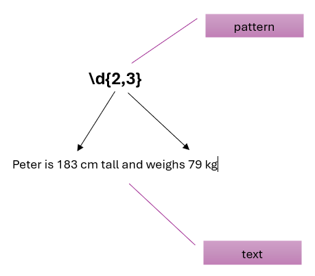

<!--
(c) Janusz Stal
Krakow University of Economics
Department of Informatics
stalj@uek.krakow.pl
-->

# FILE HANDLING

## 1. Reading from File

1. A file is a named location on disk to store data permanently. It is used to store information in a format that can be read by Python, other programs, or even a human. Python provides built-in functions and libraries to interact with files, allowing you to create, read, write, and manipulate them.

   Notice that files can be of various types, but the most common are:

   * Text files (e.g., .txt, .csv, .py): Store plain text data that is human-readable.
   
   * Binary files (e.g., images, videos, executable files): Contain data in binary format, which is not human-readable directly.

1. Watch the video on how to deal with text files in Python:

   <https://youtu.be/4mX0uPQFLDU?feature=shared>

1. Pay attention to the program below that opens and reads the contents of a text file. It is recommended to open the file in a 'with' statement. The open file is then closed automatically after executing all the statements contained in the 'with' statement block.

   > The 'r' (read) parameter in the open() function means to open the file for reading only. This is the default setting.

   ```python
   with open('example.txt', 'r') as file:
      content = file.read()
   # The file is automatically closed when the block is exited
   ```

1. To read the contents of a file, you must first open it. You can read the contents of a text file line by line, or you can read the entire contents of the file at once.

   The program print_countries.py opens a text file, reads its contents line by line, and prints the contents of each line. Analize the program code. Then, run the program.

   > If the program can't open the file 'countries.txt', look in the VSCode terminal to see what the current folder is. If it's 'ClassMaterials', change the current folder to the one that contains both the program and the file 'countries.txt' (08-FileHandling) by running the command below. Then run the program again.

      ```
      cd 08-FileHandling
      ```
   
   Notice the use of the print() statement with the end="" parameter. Its use is due to the existence of end-of-line characters at the end of lines in the text file.

   <https://www.geeksforgeeks.org/gfact-50-python-end-parameter-in-print/>

1. Modify the program print_countries.py so that the printed list of countries is numbered. Sample result:

   ```
   1. Poland, Warsaw, 38265000
   2. Germany, Berlin, 83240000
   3. France, Paris, 67850000
   4. Japan, Tokyo, 125800000
   5. Canada, Ottawa, 38250000
   ```

1. The following program prints a list of countries from 'countries.txt' file. Modify the program to print a list of countries sorted alphabetically.

   > Tip. Before printing the contents of the array, sort it alphabetically using the built-in function sorted()

   ```python
   ###
   # Reads the entire contents of a file
   #
   def read_from_file(name):
      with open(name, 'r') as file:
         content = file.read()
      return content

   # reads the entire file
   file_content = read_from_file('countries.txt')

   # splits the entire file contents into lines
   # and stores them in an array
   file_lines = file_content.splitlines()

   # prints the array
   for line in file_lines:
      print(line)
   ```


1. The file car_park.txt contains data on the number of parked cars for the last five days. Complete the following program to calculate the total number of parked cars.

   ```python
   ###
   # Reads the entire contents of a file
   #
   def read_from_file(name):
      with open(name) as file:
         content = file.read()
      return content

   # reads the entire file and splits lines into array
   file_content = read_from_file('car_park.txt')
   file_lines = file_content.splitlines()

   # calculates the total number of cars parked
   total = 0
   for line in ...:
      total += ...

   print('Total cars parked:', ...)
   ```

1. The file pets.txt contains humorous text about animals. Write a program that prints the text and counts the number of words in the text.

   > To calculate the number of words in a line, use the split() method, which splits a string into a list where each word is a list item. Then read the length of this list. Use the len() function. Finally, sum the number of words in each line.\
   <https://www.w3schools.com/python/ref_string_split.asp>

1. The file it_company.csv contains a list of employees. Write a program that displays only employees with the position "Software Engineer". Number the items on the printed list.

   > Hint: You can check if a string is contained within another string using the 'in' operator.

   ```python
   ###
   # Prints employees employed in a specified position.
   #

   # Employee List
   file_name = 'it_company.txt'

   # Position
   job_title = 'Software Engineer'

   with ... as ...:
      for line in ...:
         if job_title in ...:
            print ...
   ```


## 2. Writing to File

1. Here's a program that writes data containing the title of a movie, its director, and the lead actor to a text file. Copy the program to the movie.py file, then run the program. Finally, open the created text file in an editor and check its contents.

   > To write data to a file, you need to open it with the 'w' (write) parameter. The write() method writes one line of data to the file. Note the '\n' character. It means to move the cursor to the next line. If you don't add it, all subsequent data will be placed on one line.

   ```python
   # Program to write movie details to a text file

   # Variables containing movie details
   movie_title = "Inception"
   director = "Christopher Nolan"
   lead_actor = "Leonardo DiCaprio"

   # Name of the file to write to
   file_name = 'movie_details.txt'

   # Writing movie details to the file
   with open(file_name, 'w') as file:
      file.write(f"Movie Title: {movie_title}\n")
      file.write(f"Director: {director}\n")
      file.write(f"Lead Actor: {lead_actor}\n")

   print(f"Movie details have been written to {file_name}.")
   ```

   Read the explanation of the program:

   * Variables: movie_title, director, and lead_actor hold the details of the movie.
   * Opening the file: with open(file_name, 'w') opens the file in write mode ('w'), creating or overwriting the file.
   * Writing details: Uses the write() method to write each movie detail to the file, adding \n at the end of each line for formatting (move to next line).
   * Automatic file closing: The 'with' statement ensures the file is properly closed after writing.

1. Write a program that writes a list of the Seven Wonders of the World to a text file, in alphabetical order, with each name on a separate line. Then, open the created file in the editor and check if its contents match the task.

   ```python
   ###
   # Writes Seven Wonders of the World to a file
   #
   seven_wonders = [
      "Great Wall of China",
      "Petra",
      "Christ the Redeemer",
      "Machu Picchu",
      "Chichen Itza",
      "Roman Colosseum",
      "Taj Mahal"
   ]

   # Name of the file to write to
   file_name = 'seven_wonders.txt'

   # Sort data alphabetically
   ...

   # Write data to the file
      with ...(file_name, 'w') as ...:
         for item in ...:
            ... .write(...)
   ```

1. Write a program that copies the contents of the file 'healthy_lifestyle.txt' to the file copy_healthy_lifestyle.txt'.

   > Hint: Read the entire contents of the original file and write them to the target file (copy).

   ```python
   ###
   # Makes a copy of a text file
   #

   # file names
   original_file = 'healthy_lifestyle.txt'
   target_file = 'copy_healthy_lifestyle.txt'

   # read the content of the original file
   with ... as ...:
      content = ... .read()
   ...
   ...

   # write the content to the target file (copy)
   with ... as ...:
      ... .write(...)
   ```

1. Write a program that saves data of employees employed in the position of 'Software Engineer' to the file 'software_engineer.txt'. Data is available in the file 'it_company.csv'.

   > Hint: Read employee data line by line. For each line, check if it contains the name of the indicated position. If so, write this line to the output file.

   ```python
   ###
   # Saves to a file a list of employees working at a specified position.
   #

   # file names
   employees_file = 'it_company.csv'
   position_file = 'software_engineer.txt'

   # Position
   job_title = 'Software Engineer'

   # write selected employees to a file
   with ... as ...:
      with ... as ...:
         for line in ...:
            if job_title in ...:
               ... .write(...)
   ```

1. Write a program that allows you to create a shopping list. The program takes user input from the keyboard until the user enters 0. Each value taken is saved to a text file 'shopping_list.txt'.

   > Hint: Open the file in append mode using the 'a' (append) parameter in the open() function.

   ```python
   ###
   # Creates a shopping list based on product names
   # entered from the keyboard.
   #

   # shopping list file name
   shopping_list = 'shopping_list.txt'

   # adds product name at the end of a shopping list
   def add_product(file_name, product_name):
      with open(...,'a') as ...:
         ... .write(...)

   # Takes next product name from the keyboard
   product = ""
   while product != "0":
      product = input('Enter product name (0 stops): ')
      if product == '0':
         ... # stops entering food names ('while' breaks)
      else:
         add_...
   ```

## 3. Using Regular Expressions

1. Regular expressions (regex) are sequences of characters that define a search pattern. They are used to find, match, and manipulate text. Regular expressions provide a powerful way to perform complex text processing, such as searching for specific patterns in a string, validating input, replacing text, or extracting information from large volumes of data.

   

1. Use the interactive regular expression tutorial below to complete all the tasks in it.

   <https://regexone.com/>


1. Copy the text below into the Regex101 online editor:

   <https://regex101.com/>

   Then, for each of the following tasks, create a pattern that identifies the text chunks as described in the task.

   * Find all dates in the format "month day, year" (e.g., "March 12, 1992")
   * Locate all phone numbers in the format "XXX-XXX-XXXX" (e.g., "555-123-4567")
   * Find all numbers written with commas as thousand separators (e.g., "1,234")
   * Identify all fragments containing names starting with a capital letter (e.g., "Alice", "John", "Mike")
   * Find whole numbers in the text (e.g., "30")

   ```
   Alice was born on March 12, 1992. Her brother, John, was born on June 5, 1988. They have a mutual friend named Mike, whose phone number is 555-123-4567. In their hometown, which has a population of 1,234 or 1,235 people, a holiday festival is held every year on December 25. Alice works in an office with 30 employees. Her phone number is 555-765-4321.
   ```

1. A file report.txt contains an email with shopping report. Write a program that calculates the total value of money spent.


   > Hint: To open and read a text file that contains special characters (like the Euro sign €), you need to ensure that the file is read using the correct character encoding. The most common encoding for such cases is UTF-8, which supports a wide range of characters, including special symbols. Here is an example use of the open() function:\
   open("example.txt", "r", encoding="utf-8")


   ```python
   ###
   # Calculates the total value of money spent
   #
   import re # module for regular expressions

   # file name with shopping report
   email_file = 'report.txt'

   # read the content of email
   ...
   ...
   email = ... (email content)

   # regular expression pattern
   # for amounts
   pattern = '....'

   # extract numbers from email
   # tip: findall() method returns an array
   amounts = re.findall(pattern, email)

   # calculate the total purchases
   ...
   for amount in amounts:
      ...
   
   # print result
   print(...)
   ```
1. Many applications require that you create an account with a username and password to use them. Often, applications specify requirements for the username and password. Write a program that checks whether a username and password entered from the keyboard meet the requirements below. Use regular expressions.

   * username is at least 6 characters long
   * username contains only lowercase letters
   * password is at least 8 characters long
   * password contains only letters (lowercase and uppercase), numbers, and the underscore character

   ```python
   ###
   # Checks the correctness of username and password
   #
   import re

   # read username and password from keyboard
   username = ...
   password = ...

   # pattern (criteria) for username and password
   username_pattern = ...
   password_pattern = ...

   # check if username and password are ok
   username_match = re.match(username_pattern,username)
   ...

   # print results
   if ... and ...:
      print(...)
   else:
      ... 
   ```

## 4. Practice Makes Perfect

1. Read the chapter in your class textbook that covers the topics in this section.

1. Watch the video on how to deal with regular expressions:

   <https://youtu.be/nxjwB8up2gI?feature=shared> 

1. Note that some file operations may cause the program to stop working (e.g. there is no file on the disk with the given name). To prevent this, you can use the try-except block to handle exceptions, which are errors that can occur during the execution of a program. Exceptions might arise, for example, when attempting to divide by zero, accessing a non-existent file, or processing data in the wrong format.

   The idea behind try-except is that you place the code that might cause an error inside the try block, and if an error occurs, the except block handles it without crashing the program.

   ```python
   try:
      # code that may raise exceptions
   except ExceptionType:
      # code to handle the exception
   ```

   The program read_file.py. tries to print the contents of a file that is not on the disk. Read the contents of the program. Then run the program and see what happens. As you can see, the program stops when it encounters an error (attempting to open a nonexistent file).

   Next, see the contents of the program read_file_try_except.py, which opens and reads the contents of a file inside a try-except block. Finally, run the program. As you can see, even when an error occurs (attempting to open a nonexistent file), the program continues to run.

1. Write a program that displays the first five lines from the it_company.csv file and then prints 'Press Enter key...' in the next line and waits for the Enter key to be pressed. The program repeats printing the next five lines from the file, waiting for the Enter key to be pressed each time.

1. The file email.txt contains a raw email. Write a program that uses regular expressions to fetch and print:

   * sender email address
   * recipient email address
   * email subject
   * email body

   For each of the above commands, define a separate function (see below) that returns the value read from the email. Place the functions in a separate module called emails.

   * email_sender()
   * email_recipient()
   * email_subject()
   * email_body()

1. Write a program that calculates the number of lines, characters and words for any text file. The user enters the name of the file from the keyboard. Use a try-except block to avoid interrupting your program when the user enters a filename that doesn't exist. Print the result of the calculation. To check if the program is working correctly, find 3 text files on the Internet and use them to test the program.Sample result:

   ```
   File name: books.txt
   Number of lines: 14
   Number of characters: 2540
   Number of words: 703
   ```

1. Write a program that calculates the number of vowels in the text entered from the keyboard. Use regular expressions.

1. The files.txt contains a list of file names. Write a program that prints only those file names whose extensions consist of exactly four characters (e.g. .html).

1. Convenient processing of CSV documents is possible using the CSV module. Find on the Internet how to use this module. Then write a program that, based on the it_company.csv file, prints the first name, last name and email (in the given order, without Job Title) of people employed in the position of 'Graphic Designer'. Sample result:

   ```
   GRAPHIC DESIGNERS
   =================
   Chris Martin,chris.martin@example.com
   Jane Taylor,jane.taylor@example.com
   ...
   ...
   ```
1. The clothing.csv contains a list of clothing in stock. Write a program that prints those products whose price is less than 60 and whose stock is less than 40.

1.  Write a program that calculates, prints, and saves to a text file integers from 1 to 100 and their second and third powers. Sample result:

      ```
      1,1,1
      2,4,8
      3,9,27
      ...
      ...
      ```

1. The file books.csv contains a list of books. Write a program that copies the book data from a given genre to its corresponding file. Use functions to divide the program into logical parts.

   ```
   Genre --> Filename
   Fantasy --> books_fantasy.txt
   Historical --> books_historical.txt
   Romance --> books_romance.txt
   Classic --> books_classic.txt  
   ```
