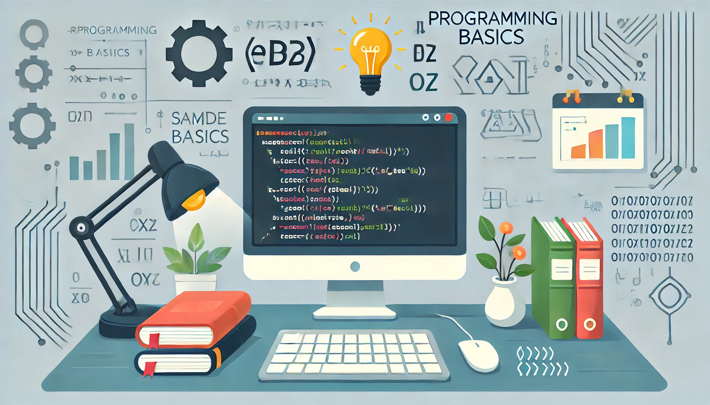

The course is designed to provide a comprehensive introduction to the fundamental concepts of programming. Through hands-on learning, students will explore essential topics, building a strong foundation in various programming paradigms and techniques. By the end of the course, participants will have developed the skills necessary to create basic programs, work with data structures, and understand different approaches to problem-solving in programming.

Main Topics:

1. Types, Variables, and Operators

    Learn about data types, how to declare and use variables, and how to perform operations with different types of data. Understand how operators (arithmetic, comparison, logical) are used to manipulate and evaluate data within programs.

1. Control Structures

    Explore control flow mechanisms such as conditional statements (if, else, switch) and loops (for, while). Learn how to direct the execution of code based on conditions and repeat tasks efficiently.

1. Subroutines

    Understand the concept of functions and procedures. Learn how to create reusable blocks of code (subroutines) that simplify program structure, reduce repetition, and enhance readability.

1. Arrays

    Delve into the use of arrays for storing collections of data. Understand how to create, access, and manipulate arrays, along with exploring multi-dimensional arrays for more complex data storage.

1. File Handling

    Learn how to read from and write to files, enabling programs to store data persistently. This includes working with different file formats (text, CSV) and understanding basic file operations such as opening, reading, writing, and closing files.

1. Dictionaries, Sets, Stacks, Queues, Lists

    Discover various data structures and their applications:

    * Dictionaries: Store data as key-value pairs for fast lookup.
    * Sets: Manage collections of unique items.
    * Stacks and Queues: Implement Last-In-First-Out (LIFO) and First-In-First-Out (FIFO) data management, respectively.
    * Lists: Create ordered collections that support dynamic resizing and manipulation.

1. Object-Oriented Programming (OOP)

    Introduction to the concepts of OOP, including classes, objects, inheritance, encapsulation, and polymorphism. Learn how to design programs by modeling real-world entities and their interactions using objects.

1. Functional Programming

    Explore the principles of functional programming, focusing on the use of pure functions, immutability, and higher-order functions. Understand how to write concise, expressive code using functional programming techniques.

This course is ideal for beginners looking to grasp the essentials of programming, as well as for those with some experience who want to deepen their understanding of various programming concepts and techniques.